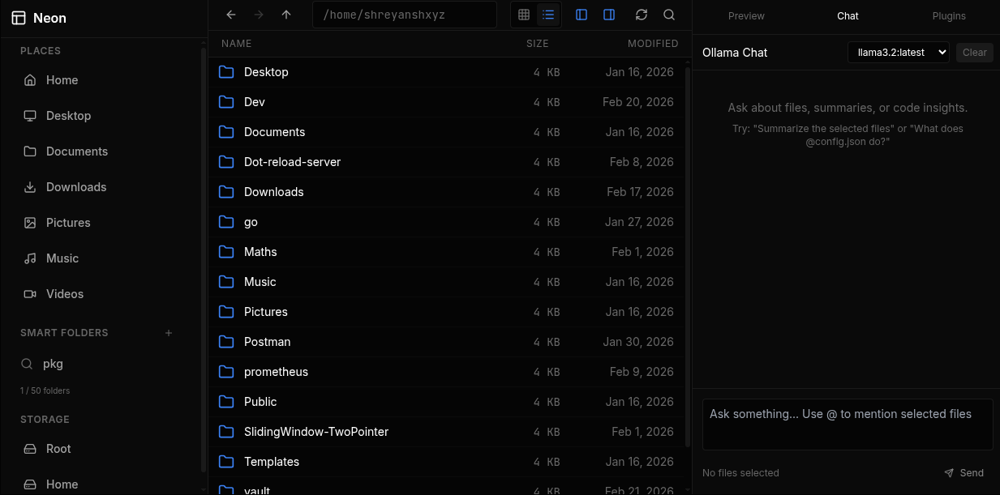
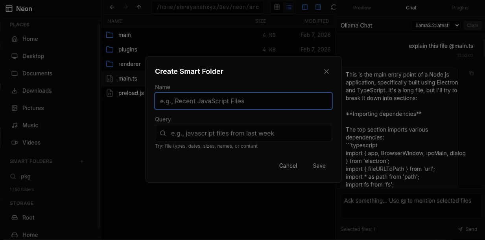
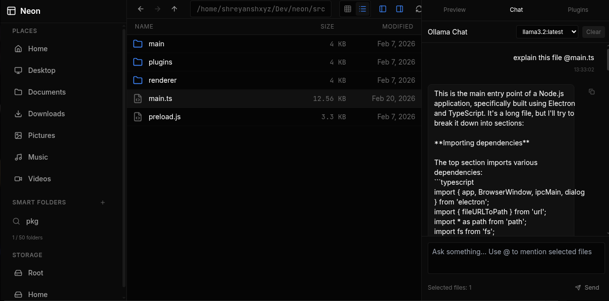
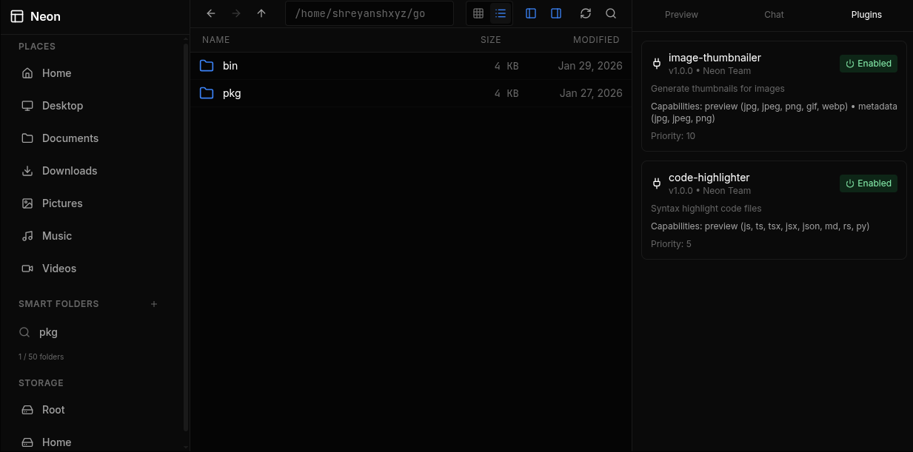
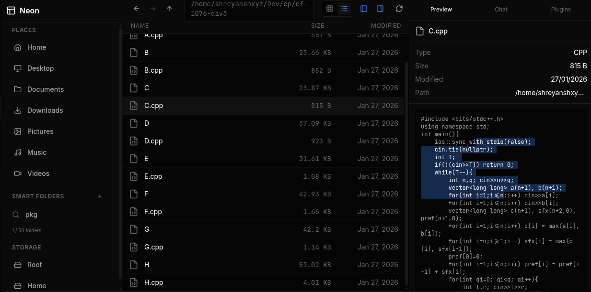
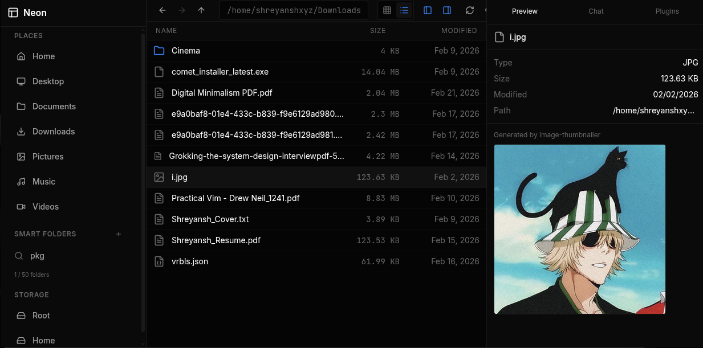

# Neon

The AI-native desktop file manager that understands natural language.

Neon is a modern desktop file manager built with Electron and React. It features intelligent file search that understands natural language queries, drag-and-drop operations, file previews, integrated AI chat via Ollama, and a complete set of file management tools.



## Features

### Natural Language File Search

Search files using natural language instead of complex queries:

- **File types**: `javascript files`, `images`, `documents`, `code files`
- **Date ranges**: `from last week`, `from 2024`, `yesterday`, `today`
- **Size filters**: `over 10MB`, `under 1MB`, `between 1MB and 10MB`
- **Name patterns**: `named main`, `called config`
- **Content search**: `containing "TODO"`, `with "function"`
- **Combined**: `javascript files from last week over 100KB`

The search system recursively indexes text files (up to 10MB) and provides relevance-ranked results with content previews.

### Smart Folders

Save searches as virtual folders that dynamically update:



Create smart folders from natural language queries and access them from the sidebar. They execute their queries on-demand, always showing current results.

### Integrated AI Chat (Ollama)

Chat with a local LLM directly in the file manager:



- Right sidebar with chat panel
- Streaming responses
- File context when @mentioned or selected
- Works with any Ollama model

### WASM Plugins

Extend functionality with WebAssembly plugins:



Built-in plugins include:

- **Code Highlighter** - Syntax highlighting for code previews
- **Image Thumbnailer** - Generate image thumbnails





### File Operations

Complete set of file management operations:

- Copy, move, delete (with trash support), rename
- Create new folders
- Clipboard operations (copy/cut/paste)
- Multi-select with Ctrl+click
- Drag and drop to move files between folders

### File Preview

Right sidebar shows file details and content:

- File metadata (size, modified date, path)
- Text file preview with syntax highlighting
- Image preview
- Binary file detection
- 10MB limit for performance

### Context Menu

Right-click anywhere for quick actions:

- Open, preview, copy, cut, paste
- Delete (moves to trash)
- Rename
- Create new folder

### Keyboard Shortcuts

| Shortcut     | Action                       |
| ------------ | ---------------------------- |
| Ctrl+F       | Open natural language search |
| Ctrl+Shift+C | Toggle chat panel            |
| Ctrl+C       | Copy selected file(s)        |
| Ctrl+X       | Cut selected file(s)         |
| Ctrl+V       | Paste from clipboard         |
| Delete       | Move to trash                |
| F2           | Rename selected file         |
| Space        | Preview selected file        |
| Ctrl+Click   | Multi-select files           |
| Enter        | Select/open file             |
| Arrow keys   | Navigate                     |
| Escape       | Close modal/panel            |

## Installation

### Download

Download the latest release for your platform:

- **Windows**: `.exe` installer
- **macOS**: `.dmg` installer
- **Linux**: `.AppImage`

See the [Releases](https://github.com/shreyanshxyz/neon/releases) page.

### Build from Source

#### Prerequisites

- Node.js 22+ and npm
- Rust (for WASM plugins)
- Linux, macOS, or Windows

#### Setup

```bash
# Clone the repository
git clone https://github.com/shreyanshxyz/neon.git
cd neon

# Install dependencies
npm install

# Build WASM plugins (requires Rust)
npm run build:plugins

# Build the project
npm run build

# Run in development mode
npm run dev

# Or build and run production build
npm start
```

### Building for Distribution

```bash
# Build for current platform
npm run dist

# Build for specific platforms
npm run dist:win    # Windows (.exe)
npm run dist:mac    # macOS (.dmg)
npm run dist:linux  # Linux (.AppImage)

# Build for all platforms
npm run dist:all
```

## Tech Stack

- **Framework**: Electron 39
- **Frontend**: React 18 + TypeScript
- **Styling**: Tailwind CSS
- **Icons**: Lucide React
- **Build**: Vite + esbuild
- **AI**: Ollama (local LLM)
- **Plugins**: WebAssembly (Rust)

## Architecture

### Main Process (Node.js)

Handles file system operations and indexing:

- `FileIndexer`: Recursive file content indexing (in-memory)
- `QueryParser`: Natural language to search criteria
- `SmartFolderService`: Persistent smart folder management
- `OllamaService`: Local LLM integration
- IPC handlers for filesystem and search operations
- Trash management (~/.neon-trash)

### Renderer Process (React)

UI components and state management:

- `useFileSystem`: File operations and navigation
- `useSearch`: Search state and query execution
- `useOllama`: AI chat integration
- Component-based architecture with hooks
- Context isolation enabled

### Search Pipeline

1. **Indexing**: Background indexing on directory navigation
2. **Parsing**: Natural language queries converted to structured criteria
3. **Search**: Multi-criteria matching (name, content, type, date, size)
4. **Ranking**: Relevance scoring based on match quality
5. **Display**: Real-time results with content highlights

## Development

### Project Structure

```
src/
├── main.ts                 # Electron main process
├── preload.js             # IPC bridge
├── renderer/
│   ├── components/
│   │   ├── FileView/      # File listing and preview
│   │   ├── Search/        # Search modal
│   │   ├── Sidebar/       # Navigation panel
│   │   ├── Chat/          # AI chat panel
│   │   └── Layout/        # Toolbar
│   ├── hooks/
│   │   ├── useFileSystem.ts
│   │   ├── useSearch.ts
│   │   └── useOllama.ts
│   ├── types/
│   └── App.tsx
├── main/services/
│   ├── FileIndexer.ts     # Content indexing
│   ├── QueryParser.ts     # Query parsing
│   ├── SmartFolderService.ts
│   └── OllamaService.ts
└── plugins/               # WASM plugins (Rust)
    ├── code-highlighter/
    └── image-thumbnailer/
```

### Available Scripts

```bash
npm run dev          # Start development mode
npm run build        # Build both processes
npm run build:main   # Build main process only
npm run build:renderer # Build renderer only
npm run build:plugins  # Build WASM plugins
npm start            # Build and run production
npm run lint         # Run ESLint
npm run format       # Run Prettier
```

### IPC API

**File System**

```typescript
window.filesystem.readDir(path);
window.filesystem.readFile(path);
window.filesystem.copy(source, dest);
window.filesystem.move(source, dest);
window.filesystem.delete(path);
```

**Search**

```typescript
window.search.indexDirectory(path);
window.search.query(query);
window.search.getStatus();
```

**Smart Folders**

```typescript
window.smartFolders.getAll();
window.smartFolders.create(data);
window.smartFolders.update(id, updates);
window.smartFolders.delete(id);
window.smartFolders.execute(id);
```

**Ollama**

```typescript
window.ollama.check();
window.ollama.chat({ messages, model? });
window.ollama.streamChat({ requestId, messages, model? }, onChunk, onDone, onError);
```

## Performance Considerations

- **Indexing**: In-memory only, no persistence
- **File size limit**: 10MB for text files
- **Recursive search**: Skips node_modules, .git, dist, build
- **Binary detection**: First 8KB analyzed
- **Content preview**: First 1000 characters stored

## Contributing

Contributions welcome. Please follow the existing code style:

- TypeScript strict mode
- No semicolons
- Single quotes
- React functional components with hooks

## License

MIT
